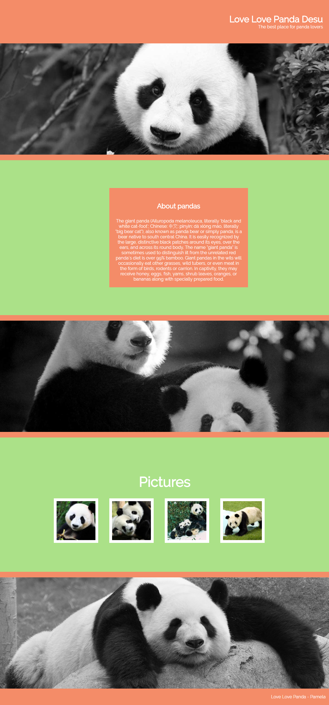

# Love Love Panda Desu

* **Curso:** _Responsive web Design_
* **Unidad 1:** _La web desde el móvil_
* **Tema** _Caso práctico N° 1_ 

***
## OBJETIVO

* Crear una página web para amantes de los pandas.

## Flujo de trabajo

### Versión 1: 
* Crear la página utilizando un grid system de tu elección (que no pertenezca a un framework como Bootstrap o Materialize). 
### Versión 2: 
* Crea tu propia versión móvil de la página

## PRODUCTO FINAL

